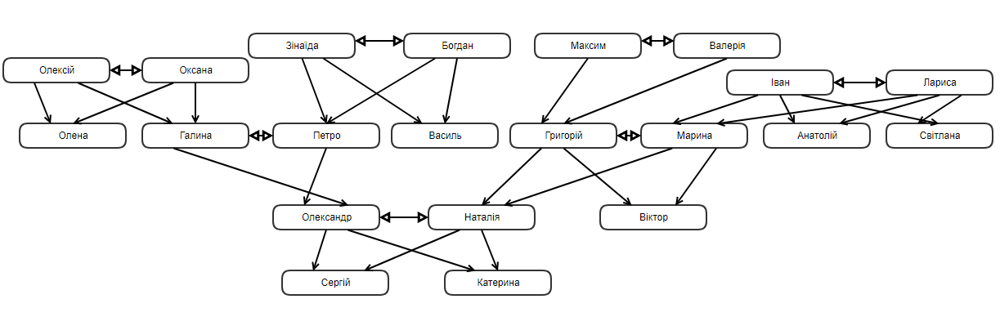

# Prolog family relations

Family Relationship in Prolog.

Відображає сімейні зв'язки на основі заданої бази знань мовою програмування Пролог, зокрема:
- батько
- мати
- діти
- дідусь
- бабуся
- сестра
- брат
- дядько
- тітка
- онук
- онука
- двоюрідний брат
- двоюрідна сестра
- племінник
- племінниця
- свекруха
- свекор
- теща
- тесть
- дівер
- шурин
- зовиця
- своячка
- зять
- невістка
- сват
- сваха

Діаграма звязків(укр. версія)

## License

The code is available under the [MIT license](LICENSE).
